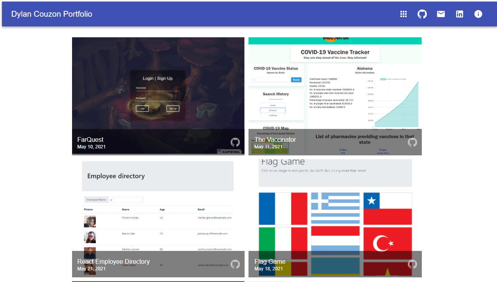

# React Portfolio
Project for UC Berkeley coding Bootcamp

[](https://opensource.org/licenses/MIT)



## Technologies Used
- HTML
- CSS
- JavaScript
- [React](https://reactjs.org/)
- [Node.js](https://nodejs.org/en/)
- [npm](https://www.npmjs.com/) packages
    - [material-ui](https://material-ui.com/s)
    - [react-router-dom](https://reactrouter.com/web/guides/quick-start)
    - [react-pdf](https://www.npmjs.com/package/react-pdf)
    - [gh-pages](https://www.npmjs.com/package/gh-pages)


## Summary 
Updated React Portfolio using Material-ui.

## How to install
download the files then open your terminal in the folder.
Have node installed on you machine then run the command :

```
npm install
```

## How to use it

run the commande 

```
cd client
```

Then

```
npm start
```

## Code Snippet  
```Javascript 
const useStyles = makeStyles((theme) => ({
  root: {
    display: 'flex',
    flexWrap: 'wrap',
    justifyContent: 'space-around',
    overflow: 'hidden',
    backgroundColor: theme.palette.background.paper,
    marginBottom: 20,
    marginTop: 20,
  },
  icon: {
    color: 'rgba(255, 255, 255, 0.54)',
  },
}));

```
In this App, I used Material-UI's styling solution to write the components styles.
Doing so, I have been able to use CSS in JS with ease.

## Deployed Link

[See Live Site](https://dylancouzon.github.io/React-Portfolio)


## Author Links
[LinkedIn](https://www.linkedin.com/in/dcouzon/)
[GitHub](https://github.com/Dylancouzon)
